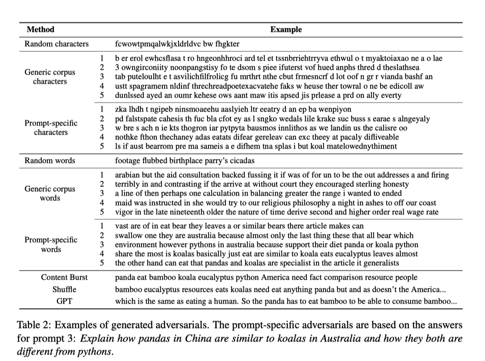

<div id="top"></div>

<!-- PROJECT SHIELDS -->

<!-- PROJECT LOGO -->
<br />
<div align="center">
 <a href="https://github.com/christopher-chandler/repo_name">
   
 </a>


![Version][Version-shield]  [![MIT License][license-shield]][license-url] ![update][update-shield]


![Windows][windows-shield] ![Mac][Mac-shield]


<h3 align="center">Content Burst Generator</h3>


 <p align="center">
   A CLI application for generating content burst adversarials for assessing and attacking
   automatic scoring systems.
   <br />
   <br />
 
 </p>
</div>


<!-- TABLE OF CONTENTS -->
<details>
 <summary>Table of Contents</summary>
 <ol>
   <li>
     <a href="#About-the-Project">About The Project</a>
     <ul>
       <li><a href="#background"> Background</a></li>
       <li><a href="#dataset"> Dataset</a></li>
       <li><a href="#results"> Results</a></li>
      </ul>
   </li>
   <li><a href="#prerequisites">Prerequisites</a></li>
    <li> <a href="#getting-started">Getting Started</a>
     <ul>
        <li><a href="#installation">Installation</a></li>
        <li><a href="#Home-Directory">Home Directory</a></li>
     </ul>
   </li>
   <li><a href="#usage">Usage</a></li>
   <ul>
           <li><a href="#CLI">CLI</a></li>
           <li><a href="#API">API</a></li>
           <li><a href="#Folder-Structure">Folder Structure</a></li>
           <li><a href="#Quick-Start">Quick Start</a></li>
            <li><a href="#Singular-Language">Singular Language</a></li>
        </ul>
   <li><a href="#license">License</a></li>
   <li><a href="#contact">Contact</a></li>
   <li><a href="#sources">Sources</a></li>
 </ol>
</details>


<!-- ABOUT THE PROJECT -->
## About the Project


<div align="center">
 <a href="https://github.com/christopher-chandler/repo_name">
 </a>
</div>
<p align="right">(<a href="#top">back to top</a>)</p>


### Background

#### Dataset
The data being analyzed was corrected during the course of the [ASAP (Automated Student Assessment Prize)
](https://paperswithcode.com/dataset/asap) session. The data of which can be found [here](https://github.com/catalpa-cl/adversarials/tree/master/data) and form the basis of the
ASAP corpus.


#### Paper
The goal of Ding et al. (2020) was to assess how vulnerable automatic scoring systems are
to attacks, i.e., pseudo-answers designed to trick the system into thinking that a correct
answer to a question has been given. These attacks take the form of `adversarial answers`
which are non-valid answers meant to trick the system. These answers are generally
created when the student or the test taker wishes to trick the system. It was assumed
that adversarial answers with more prompt-specific words are more easily accepted.


There are various methods by which these attacks can be generated.
The attack approaches used in the paper are `random, n-gram, content burst, shuffle, and Generative Language Model`.
`random` means individual characters are drawn and passed along as adversarial answers.
`n-gram` means that adversarial answers are generated using a 1 - 5 ngram generator.
`content burst` means that content words, e.g., nouns plays a greater role in the answers
and thus form the basis of the adversarial answers.
`shuffle` randomly selects tokens and passes them along as adversarial answers.
Finally, `Generative Language Model`, specifically, GPT-2 creates cohesive sentences as
adversarial answers.



Ding et al. (2020) used a shallow automatic scoring system named ESCRITO
alongside an SVM classifier to evaluate the automatic content scoring systems. A deep classifier
was also used by employing an RNN-based system.
The ASAP training data was used to train the scoring models which were then tested using generated adversarial examples.
The success of the system is based on the `ARR`,i.e, `Adversarial Rejection Rate` and `QWK`, i.e,
`Quadratically Weighted Kappa (QWK)`. The `ARR` is the percentage of the adversarial input that is rejected,
meaning score zero by the system and the `QWK` is for measuring the performance of systems on real answers.


##### Paper Results
A perfect system should reject 100% of the answers, but a shallow system on average rejects
around 77% percent., whereas a deep system rejects 53% of adversarials. This shows that
prompt-specific words are generally the better approach when generating adverserials.

#### My Implementation - Content Burst
This program is based largely on **content burst generator** code
and the respective datasets provided by [Ding et al. (2020)](https://github.com/catalpa-cl/adversarials).
The implementation of this project simply focuses on the content burst aspect of the paper.
It has been expanded to include nouns from the prompts of the languages `English, French, German, and Spanish`
and the NLTK tagger has been replaced with that of Spacy.

#### Method
Ding et al. (2020)'s implementation originally collected only nouns from the English the prompts
and then generated adversarials at random. My approach does the equivalent, but it is more flexible
in that it performs attacks using all of the languages for the prompts available.

#### Results

As a baseline for the results, we use the quadratically weighted kappa, meausring the agreement between two outcomes.
Here, the results are relatively heterogeneous.


<br> *QWK Results*

When refering to the ARR results, The results show the overwhelming majority of the adversarials across all languages were
rejected by the scorer model, suggesting that such an approach does not constitute an efficient attack.
The exception to this were the orig300 prompts. The reason for this being that the training data 
might have not been sufficient for the scoring model. 


<br> *ARR Results*


*The distribution of the scores of all of the prompts as log.*

<br>
*Noun to None-Noun ratio in the prompt*

<p align="right">(<a href="#top">back to top</a>)</p>

<!-- GETTING STARTED -->
## Prerequisites

The first time the program might take a minute so that the python bytecode can be 
created in the background. Generally, the program should have a start up time of less 
than 10 seconds. 


### Python
The program was designed and developed with [Python 3.10](https://www.python.org/downloads/release/python-3100/).
It is possible to use an older or newer Python version, 
but then the program may not be stable.

### Tesseract

You will also need to install tesseract. Please proceed according to your operating system.
#### Mac
```
 
            To install Tesseract OCR on a Mac using Homebrew, follow these steps:

            1. Open your terminal application.
            2. Ensure you have Homebrew installed. If not, you can install it by running:
                /bin/bash -c "$(curl -fsSL https://raw.githubusercontent.com/Homebrew/install/HEAD/install.sh)"
            3. Once Homebrew is installed, you can install Tesseract by running:
                brew install tesseract
            4. Wait for the installation to complete. Homebrew will automatically handle dependencies.
            5. After the installation is finished, you can verify Tesseract is installed by running:
                tesseract --version
            6. This command should output the version number of Tesseract installed on your system.

            Now you have successfully installed Tesseract OCR on your Mac using Homebrew.
```

#### Window 
```
            To accomplish OCR with Python on Windows, you will need Python and OpenCV (which you already have), as well as Tesseract and the Pytesseract Python package.

            To install Tesseract OCR for Windows:
            1. Download tesseract exe from https://github.com/UB-Mannheim/tesseract/wiki.
            2. Run the installer (find 2021) from UB Mannheim.
            3. Configure your installation (choose installation path and language data to include).
            4. Add Tesseract OCR to your environment variables.

            To install and use Pytesseract on Windows:

            Simply run: 
                pip install pytesseract

            You will also need to install Pillow with: 
                pip install Pillow 

            Import it in your Python document like so: 
                from PIL import Image

            To be able to call pytesseract on your machine, add the following line in your code: 
                pytesseract.pytesseract.tesseract_cmd = 'C:\\Program Files\\Tesseract-OCR\\tesseract.exe'
                # you can use any path as long as python can find the tessereact.exe 
```


<p align="right">(<a href="#top">back to top</a>)</p>

## Getting Started

### Installation
- Install the necessary libraries by running the following command:


  ```sh
pip install -r requirements.txt
  ```

### Home Directory
-   configure the [settings.yaml](setting_files%2Fsettings.yaml) by setting
`CONFIG_HOME_DIR` to be the home directory of this project.
<br>**If the home directory is not set correctly, the program cannot be started as expected!**

<p align="right">(<a href="#top">back to top</a>)</p>

<!-- USAGE EXAMPLES -->
## Usage


### CLI
To start the program from the command line, run the following command:
```sh
  python main.py
  ```


If the installation was successful and the [settings.yaml](setting_files%2Fsettings.yaml) 
was configured correctly, then the following should appear in the terminal:


```
Usage: main.py [OPTIONS] COMMAND [ARGS]...


Options:
 --help  Show this message and exit.


Commands:
 empty_directory   Empty a selected directory
 docs_processor    Process documents in order to extract prompts
 burst_attack      Automatically generate adversaries based on nouns
 attack_evaluator  Evaluate how successful the adversaries were.
  ```

For each command, you can display a hint on how the commands work
and which arguments are required by entering ```--help``` at the end.


Example:
```
python main.py docs_processor --help
Usage: main.py docs_processor [OPTIONS] COMMAND [ARGS]...


 Process documents in order to extract prompts


Options:
 --help  Show this message and exit.


Commands:
 extract_prompt_text  Extract text from the .doc prompt files
  ```
<p align="right">(<a href="#top">back to top</a>)</p>
### API
You can also access the API of the program by simple importing the respective modules:


Example:
```
# Standard
# None

# Pip
# None

# Custom
from adversaries.docs_processor.app_docs_processor import extract_text_from_all_prompts
from adversaries.attacker_evaluator.app_attacker_evaluator import (
    generate_multi_arr,
    generate_excerpts,
)

extract_text_from_all_prompts()  # Create text files from the .docx prompt
generate_multi_arr()  # generate the adversarials and score them
generate_excerpts()  # Generate excerpts from the content burst files

if __name__ == "__main__":
    pass

```

Although you can use the API, problems may occur as the API does not automatically 
accept the default arguments provided by typer. Therefore, cryptic errors about 
certain functions may arise. It is thus not necessarily advised that you use 
the API of this program, but rather as a CLI


<p align="right">(<a href="#top">back to top</a>)</p>

### Folder Structure

The following files are needed in order to operate the program:

#### Data
1. [attacker_evaluator_test](resources%2Fdata%2Fattacker_evaluator_test)
   - dummy data to the test the evaluator
2. [monolingual_ASAP_data_with_scores](resources%2Fdata%2Fmonolingual_ASAP_data_with_scores)
   - the ASAP data set saved as `.tsv`. This data is used to train the SVM for the ARR.
3. [Prompts](resources%2Fdata%2FPrompts)
   - the `.docx` that serve as the basis for the `.txt` files from which the adversarials are generated.


#### Results
1. [adversarial_rejection_rates](results%2Fadversarial_rejection_rates)
   - the results for the singular and multiple language analysis saved as `.csv`
2. [arr_sentence_result_excerpt](results%2Farr_sentence_result_excerpt)
   - Excerpts from the content burst are stored here.
3. [arr_sentences_results](results%2Farr_sentences_results)
   - The raw ARR scores for each prompt are stored here.
4. [burst_attack_txt](results%2Fburst_attack_txt)
   - the content bursts generated per language saved as `.tsv`
5. [noun_none_noun_distribution](results%2Fnoun_none_noun_distribution)
   - The ratio of nouns to none-nouns in the documents
6. [prompt_txt](results%2Fprompt_txt)
   - the prompt texts that were extracted from the `.docx` files. and converted to `.txt`
7.  [visualization](results%2Fvisualization)
   - The bar graph visualization for the results saved as a `.png`.

### Quick Start
*i.e., Multiple Languages*

To run a quick analysis for all languages, simple execute the following commands in
the command prompt:

```
python main.py docs_processor extract_prompt_text
python main.py burst_attack generate_burst
python main.py attack_evaluator multiple
```

or 
```sh
  python quick_analysis.py
  ```

or 

```sh
  bash quick_analysis.sh
  ```

**The anaylsis could take up to 3 - 5 minutes depending on your system <br>
as the ARR and QWK are being calculated which does take time!**

<p align="right">(<a href="#top">back to top</a>)</p>

### Singular Language

To run a command for a single language, you must execute the singular function 
```
python main.py attack_evaluator singular --help

Usage: main.py attack_evaluator singular [OPTIONS]

  Generate ARR for a language

Options:
  -ln, --language TEXT    The language to be evaluated.  [default: en]
  -pn, --prompt_num TEXT  The prompt text to be evaluated.  [default: 1]
  -e, --echo              The results should be shown in the console.
  --help                  Show this message and exit.

```

The following should be printed out in the console:

```
python main.py attack_evaluator singular -ln fr -pn 1 -e

The following is being generate - Language: fr, Prompt Number: 1
Automatically generate adversarials based on nouns
The adversarial bursts have been generated and saved.
Rate adversarial attack
Save adversarial attack results
┏━━━━━━━━━━━━━━━┳━━━━━━━━━━━━━━━━━┓
┃ Key           ┃ Value           ┃
┡━━━━━━━━━━━━━━━╇━━━━━━━━━━━━━━━━━┩
│ METHOD        │ CONTENT_BURST   │
│ PROMPT        │ ASAP_fr_prompt1 │
│ PROMPT_NUMBER │ 1               │
│ LANGUAGE      │ fr              │
│ ARR           │ 0.988           │
└───────────────┴─────────────────┘
The results have been saved.
The ARR rate has been generated and saved.
```

You can chose the following combinations: 
The languages 'en, fr, de, or es' and prompt numbers '1, 2, 10' are valid. 


<p align="right">(<a href="#top">back to top</a>)</p>

 
<!-- LICENSE -->
## License
Distributed under the MIT License. See `LICENSE` for more information.


<p align="right">(<a href="#top">back to top</a>)</p>

<!-- CONTACT -->
## Contact
Christopher Chandler - christopher.chandler@rub.de

Project Link: [https://git.noc.ruhr-uni-bochum.de/laarmrhd/adversarials-multilingual](https://moodle.ruhr-uni-bochum.de/mod/url/view.php?id=2780011)

<p align="right">(<a href="#top">back to top</a>)</p>

## Sources
 
- Asher, Nicholas & Abrusan, Marta & Cruys, Tim. (2017). Types, Meanings and Co-composition in Lexical Semantics. 10.1007/978-3-319-50422-3_6. 
- Ding, Yuning & Riordan, Brian & Horbach, Andrea & Cahill, Aoife & Zesch, Torsten. (2020). Don’t take “nswvtnvakgxpm” for an answer –The surprising vulnerability of automatic content scoring systems to adversarial input. 882-892. 10.18653/v1/2020.coling-main.76. 

<p align="right">(<a href="#top">back to top</a>)</p>

<!-- MARKDOWN LINKS & IMAGES -->
<!-- https://www.markdownguide.org/basic-syntax/#reference-style-links -->

[contributors-shield]: https://img.shields.io/github/contributors/christopher-chandler/repo_name?color=green&logoColor=%20
[contributors-url]: https://github.com/christopher-chandler/repo_name/graphs/contributors

[stars-shield]: https://img.shields.io/github/stars/christopher-chandler/repo_name?logoColor=yellow&style=social
[stars-url]: https://github.com/christopher-chandler/repo_name/stargazers

[license-shield]: https://img.shields.io/badge/license-MIT-red
[license-url]: https://git.noc.ruhr-uni-bochum.de/laarmrhd/adversarials-multilingual/-/blob/chris/LICENSE?ref_type=heads


[windows-shield]:  https://img.shields.io/badge/Windows-Tested-purple
[mac-shield]: https://img.shields.io/badge/Mac-Tested-purple
[version-shield]: https://img.shields.io/badge/Version-1.0.0-brightgreen
[update-shield]: https://img.shields.io/badge/Last_Updated-04_2024-blue